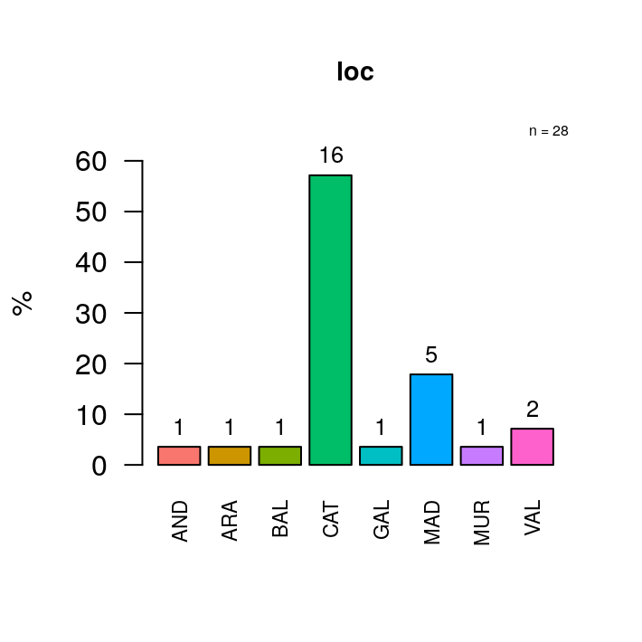
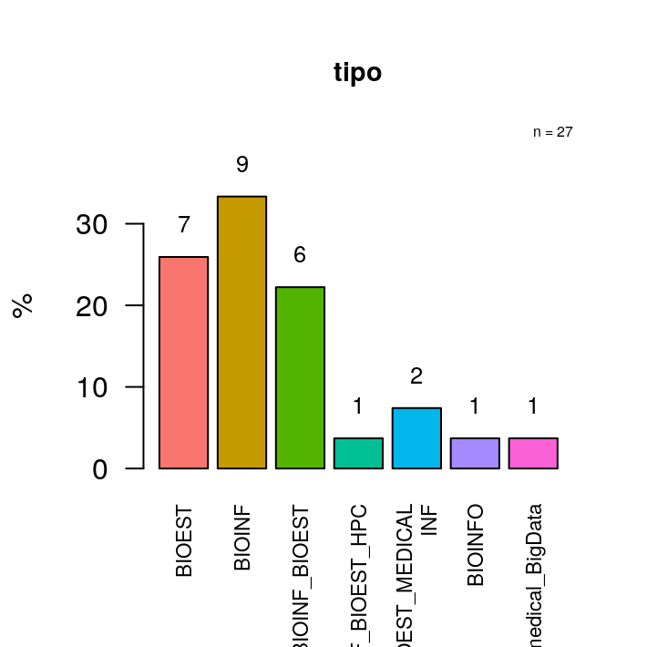
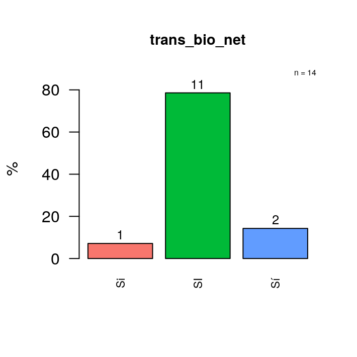
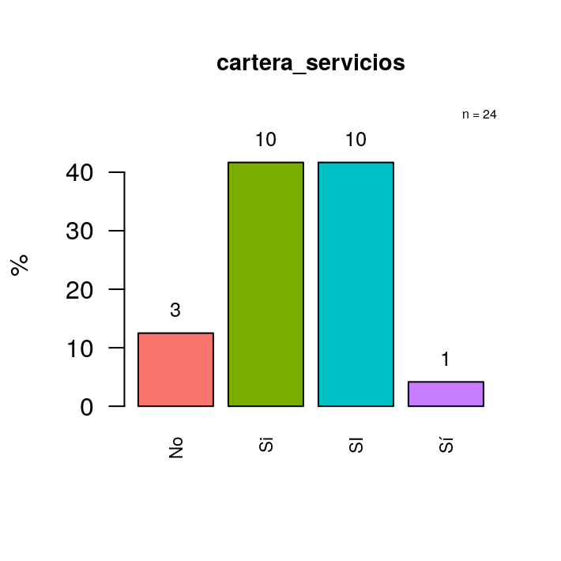
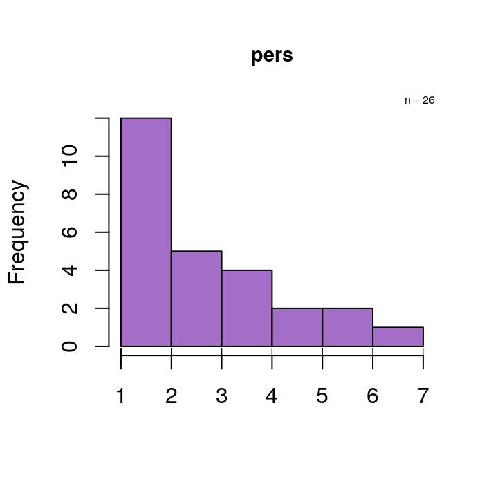
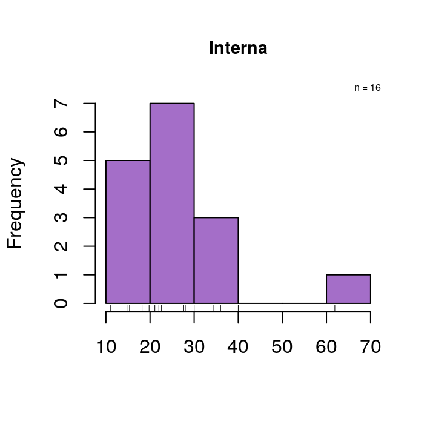
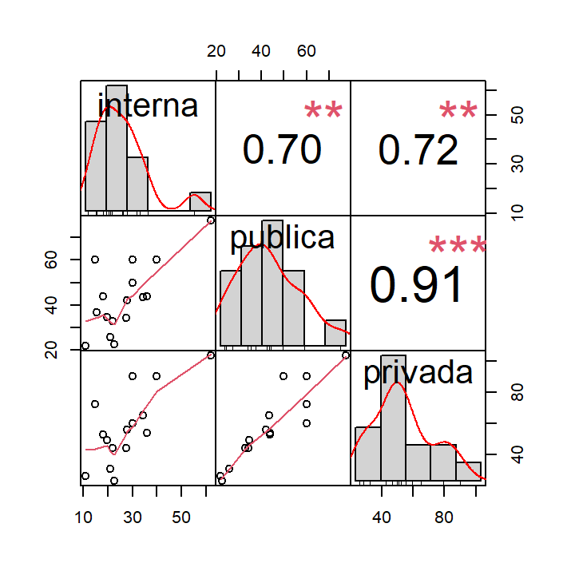

```r
library(devtools)
if (!require(anaStatsUEB)) install_github("uebvhir/anaStatsUEB")
if (!require(mmotaF))install_github("miriammota/mmotaF")
if (!require(PerformanceAnalytics)) install.packages("PerformanceAnalytics")
```


# Introducción

Este documento presenta una primera aproximación a una comparación de tarifas de unidades de bioinformática y bioestadística.

Esta comparativa se inició en Barcelona, en el Vall d'Hebrón Institut de Recerca (VHIR) y se ha ido extendiendo -bajo el impulso de TransBionet- a otros centros catalanes y españoles, lo que explica el reparto desigual entre comunidades. 
La muestra de unidades no es aleatoria sino oportunista: se ha recogido los datos a los que se ha tenido acceso. Ahora bien, como el número total de unidades no es muy alto es probable que se pueda considerar relativamente representativa.

En esta primera aproximación nos limitaremos a explorar la tabla de datos recogida con el objetivo de responder dos preguntas.

- En base a qué criterios se facturan los servicios
- Cuianto se cobra por los servicios de las unidades según si los clientes son "internos", "públicos" o "privados", clasificación adoptada por la mayoría de las unidades.


# Los datos

Los datos para el análisis se encuentran en una hoja de `googlesheets` a la que se puede acceder y modificar por su enlace por lo que, de momento se trabajará con una versión descargada del sitio.


```r
library(readxl)
#compTarifas <- read_excel("datos/Comparativa de tarifas entre unidades.xlsx")
compTarifas <- read_excel("datos/Comparativa de tarifas entre unidades-20200710.xlsx")
```


```r
library(anaStatsUEB)
library(mmotaF)
```

Nos quedamos con el subconjunto a analizar


```r
library(dplyr)
compTarifas_short <- as.data.frame(select(compTarifas, ID_centro, LOC, Tipo, TransBioNet, Criterio, Pers., Interna, Publica, Privada))
desc_data(compTarifas_short)
```

<table class="table" style="font-size: 13px; width: auto !important; ">
<caption style="font-size: initial !important;">Summary Data. <br> N variables: 9.  N observaciones: 28 <br> Max level: 7.  Max NA: 80%</caption>
 <thead>
  <tr>
   <th style="text-align:left;"> Variable </th>
   <th style="text-align:left;"> Type </th>
   <th style="text-align:left;"> [Min,Max] or Levels </th>
   <th style="text-align:left;"> Valid cases, n (%) <br>  Missings, n (%) </th>
  </tr>
 </thead>
<tbody>
  <tr>
   <td style="text-align:left;"> ID_centro </td>
   <td style="text-align:left;"> character </td>
   <td style="text-align:left;"> <span style="     color: black !important;">-</span> </td>
   <td style="text-align:left;"> <span style="     color: black !important;">28 (100%) <br> 0 (0%)</span> </td>
  </tr>
  <tr>
   <td style="text-align:left;"> LOC </td>
   <td style="text-align:left;"> character </td>
   <td style="text-align:left;"> <span style="     color: black !important;">-</span> </td>
   <td style="text-align:left;"> <span style="     color: black !important;">28 (100%) <br> 0 (0%)</span> </td>
  </tr>
  <tr>
   <td style="text-align:left;"> Tipo </td>
   <td style="text-align:left;"> character </td>
   <td style="text-align:left;"> <span style="     color: black !important;">-</span> </td>
   <td style="text-align:left;"> <span style="     color: black !important;">27 (96.429%) <br> 1 (3.571%)</span> </td>
  </tr>
  <tr>
   <td style="text-align:left;"> TransBioNet </td>
   <td style="text-align:left;"> character </td>
   <td style="text-align:left;"> <span style="     color: black !important;">-</span> </td>
   <td style="text-align:left;"> <span style="     color: black !important;">27 (96.429%) <br> 1 (3.571%)</span> </td>
  </tr>
  <tr>
   <td style="text-align:left;"> Criterio </td>
   <td style="text-align:left;"> character </td>
   <td style="text-align:left;"> <span style="     color: black !important;">-</span> </td>
   <td style="text-align:left;"> <span style="     color: black !important;">23 (82.143%) <br> 5 (17.857%)</span> </td>
  </tr>
  <tr>
   <td style="text-align:left;"> Pers. </td>
   <td style="text-align:left;"> numeric </td>
   <td style="text-align:left;"> <span style="     color: black !important;">[1, 7]</span> </td>
   <td style="text-align:left;"> <span style="     color: black !important;">26 (92.857%) <br> 2 (7.143%)</span> </td>
  </tr>
  <tr>
   <td style="text-align:left;"> Interna </td>
   <td style="text-align:left;"> numeric </td>
   <td style="text-align:left;"> <span style="     color: black !important;">[11, 61.9]</span> </td>
   <td style="text-align:left;"> <span style="     color: black !important;">16 (57.143%) <br> 12 (42.857%)</span> </td>
  </tr>
  <tr>
   <td style="text-align:left;"> Publica </td>
   <td style="text-align:left;"> numeric </td>
   <td style="text-align:left;"> <span style="     color: black !important;">[22, 77.4]</span> </td>
   <td style="text-align:left;"> <span style="     color: black !important;">16 (57.143%) <br> 12 (42.857%)</span> </td>
  </tr>
  <tr>
   <td style="text-align:left;"> Privada </td>
   <td style="text-align:left;"> numeric </td>
   <td style="text-align:left;"> <span style="     color: black !important;">[23.3, 103.2]</span> </td>
   <td style="text-align:left;"> <span style="     color: black !important;">15 (53.571%) <br> 13 (46.429%)</span> </td>
  </tr>
</tbody>
</table>

Recodificamos las variables carácter a factores


```r
var2fac <- names(which(sapply(compTarifas_short, is.character))) [-1]
compTarifas_short[,var2fac] <- lapply(compTarifas_short[,var2fac] , factor) 
```

Limpiamos los datos para eliminar errores (e.g SI y Si como respuestas)


```r
compTarifas_short <- janitor::clean_names(compTarifas_short) 
```


```r
compTarifas_short$cartera_servicios[ grep("SI|Si", compTarifas_short$cartera_servicios)] <- "Sí" 
compTarifas_short$cartera_servicios<- factor_ueb(compTarifas_short$cartera_servicios) 
compTarifas_short$trans_bio_net[ grep("SI|Si", compTarifas_short$trans_bio_net)] <- "Sí" 
compTarifas_short$trans_bio_net<- factor_ueb(compTarifas_short$trans_bio_net) 
```


# Resumen de los datos

## Resumenes numericos

Un rápido resumen de algunas de las variables:


```r
library(anaStatsUEB)
library(mmotaF)
dscgroup<- desc_group (covariates = names(compTarifas_short), data = compTarifas_short)
dscgroup$results
```

<table class="table" style="font-size: 13px; width: auto !important; margin-left: auto; margin-right: auto;">
<caption style="font-size: initial !important;">Summary statistics table</caption>
 <thead>
  <tr>
   <th style="text-align:center;position: sticky; top:0; background-color: #FFFFFF;color: white !important;background-color: #993489 !important;"> variable </th>
   <th style="text-align:left;position: sticky; top:0; background-color: #FFFFFF;color: white !important;background-color: #993489 !important;"> levels </th>
   <th style="text-align:center;position: sticky; top:0; background-color: #FFFFFF;color: white !important;background-color: #993489 !important;"> ALL </th>
   <th style="text-align:center;position: sticky; top:0; background-color: #FFFFFF;color: white !important;background-color: #993489 !important;"> n </th>
  </tr>
 </thead>
<tbody>
  <tr>
   <td style="text-align:center;font-weight: bold;"> loc<sub>1</sub> </td>
   <td style="text-align:left;max-width: 8em; "> AND </td>
   <td style="text-align:center;font-weight: bold;"> 1 (3.6%) <br> [0.1; 18.3] </td>
   <td style="text-align:center;"> 28 </td>
  </tr>
  <tr>
   <td style="text-align:center;font-weight: bold;">  </td>
   <td style="text-align:left;max-width: 8em; "> ARA </td>
   <td style="text-align:center;font-weight: bold;"> 1 (3.6%) <br> [0.1; 18.3] </td>
   <td style="text-align:center;">  </td>
  </tr>
  <tr>
   <td style="text-align:center;font-weight: bold;">  </td>
   <td style="text-align:left;max-width: 8em; "> BAL </td>
   <td style="text-align:center;font-weight: bold;"> 1 (3.6%) <br> [0.1; 18.3] </td>
   <td style="text-align:center;">  </td>
  </tr>
  <tr>
   <td style="text-align:center;font-weight: bold;">  </td>
   <td style="text-align:left;max-width: 8em; "> CAT </td>
   <td style="text-align:center;font-weight: bold;"> 16 (57.1%) <br> [37.2; 75.5] </td>
   <td style="text-align:center;">  </td>
  </tr>
  <tr>
   <td style="text-align:center;font-weight: bold;">  </td>
   <td style="text-align:left;max-width: 8em; "> GAL </td>
   <td style="text-align:center;font-weight: bold;"> 1 (3.6%) <br> [0.1; 18.3] </td>
   <td style="text-align:center;">  </td>
  </tr>
  <tr>
   <td style="text-align:center;font-weight: bold;">  </td>
   <td style="text-align:left;max-width: 8em; "> MAD </td>
   <td style="text-align:center;font-weight: bold;"> 5 (17.9%) <br> [6.1; 36.9] </td>
   <td style="text-align:center;">  </td>
  </tr>
  <tr>
   <td style="text-align:center;font-weight: bold;">  </td>
   <td style="text-align:left;max-width: 8em; "> MUR </td>
   <td style="text-align:center;font-weight: bold;"> 1 (3.6%) <br> [0.1; 18.3] </td>
   <td style="text-align:center;">  </td>
  </tr>
  <tr>
   <td style="text-align:center;font-weight: bold;">  </td>
   <td style="text-align:left;max-width: 8em; "> VAL </td>
   <td style="text-align:center;font-weight: bold;"> 2 (7.1%) <br> [0.9; 23.5] </td>
   <td style="text-align:center;">  </td>
  </tr>
  <tr>
   <td style="text-align:center;font-weight: bold;"> tipo<sub>1</sub> </td>
   <td style="text-align:left;max-width: 8em; "> BIOEST </td>
   <td style="text-align:center;font-weight: bold;"> 7 (25.9%) <br> [11.1; 46.3] </td>
   <td style="text-align:center;"> 27 </td>
  </tr>
  <tr>
   <td style="text-align:center;font-weight: bold;">  </td>
   <td style="text-align:left;max-width: 8em; "> BIOINF </td>
   <td style="text-align:center;font-weight: bold;"> 10 (37%) <br> [19.4; 57.6] </td>
   <td style="text-align:center;">  </td>
  </tr>
  <tr>
   <td style="text-align:center;font-weight: bold;">  </td>
   <td style="text-align:left;max-width: 8em; "> BIOINF_BIOEST </td>
   <td style="text-align:center;font-weight: bold;"> 6 (22.2%) <br> [8.6; 42.3] </td>
   <td style="text-align:center;">  </td>
  </tr>
  <tr>
   <td style="text-align:center;font-weight: bold;">  </td>
   <td style="text-align:left;max-width: 8em; "> BIOINF_BIOEST_HPC </td>
   <td style="text-align:center;font-weight: bold;"> 1 (3.7%) <br> [0.1; 19] </td>
   <td style="text-align:center;">  </td>
  </tr>
  <tr>
   <td style="text-align:center;font-weight: bold;">  </td>
   <td style="text-align:left;max-width: 8em; "> BIOINF_BIOEST_MEDICALINF </td>
   <td style="text-align:center;font-weight: bold;"> 2 (7.4%) <br> [0.9; 24.3] </td>
   <td style="text-align:center;">  </td>
  </tr>
  <tr>
   <td style="text-align:center;font-weight: bold;">  </td>
   <td style="text-align:left;max-width: 8em; "> BIOINFO_Biomedical_BigData </td>
   <td style="text-align:center;font-weight: bold;"> 1 (3.7%) <br> [0.1; 19] </td>
   <td style="text-align:center;">  </td>
  </tr>
  <tr>
   <td style="text-align:center;font-weight: bold;"> trans_bio_net<sub>1</sub> </td>
   <td style="text-align:left;max-width: 8em; "> NO </td>
   <td style="text-align:center;font-weight: bold;"> 11 (40.7%) <br> [22.4; 61.2] </td>
   <td style="text-align:center;"> 27 </td>
  </tr>
  <tr>
   <td style="text-align:center;font-weight: bold;">  </td>
   <td style="text-align:left;max-width: 8em; "> SI </td>
   <td style="text-align:center;font-weight: bold;"> 16 (59.3%) <br> [38.8; 77.6] </td>
   <td style="text-align:center;">  </td>
  </tr>
  <tr>
   <td style="text-align:center;font-weight: bold;"> criterio<sub>1</sub> </td>
   <td style="text-align:left;max-width: 8em; "> Por horas </td>
   <td style="text-align:center;font-weight: bold;"> 12 (52.2%) <br> [30.6; 73.2] </td>
   <td style="text-align:center;"> 23 </td>
  </tr>
  <tr>
   <td style="text-align:center;font-weight: bold;">  </td>
   <td style="text-align:left;max-width: 8em; "> Por servicio, muestras y por horas </td>
   <td style="text-align:center;font-weight: bold;"> 2 (8.7%) <br> [1.1; 28] </td>
   <td style="text-align:center;">  </td>
  </tr>
  <tr>
   <td style="text-align:center;font-weight: bold;">  </td>
   <td style="text-align:left;max-width: 8em; "> Por servicios </td>
   <td style="text-align:center;font-weight: bold;"> 1 (4.3%) <br> [0.1; 21.9] </td>
   <td style="text-align:center;">  </td>
  </tr>
  <tr>
   <td style="text-align:center;font-weight: bold;">  </td>
   <td style="text-align:left;max-width: 8em; "> Por servicios y horas </td>
   <td style="text-align:center;font-weight: bold;"> 3 (13%) <br> [2.8; 33.6] </td>
   <td style="text-align:center;">  </td>
  </tr>
  <tr>
   <td style="text-align:center;font-weight: bold;">  </td>
   <td style="text-align:left;max-width: 8em; "> Por tandas </td>
   <td style="text-align:center;font-weight: bold;"> 1 (4.3%) <br> [0.1; 21.9] </td>
   <td style="text-align:center;">  </td>
  </tr>
  <tr>
   <td style="text-align:center;font-weight: bold;">  </td>
   <td style="text-align:left;max-width: 8em; "> Por tandas y por muestra adicional </td>
   <td style="text-align:center;font-weight: bold;"> 1 (4.3%) <br> [0.1; 21.9] </td>
   <td style="text-align:center;">  </td>
  </tr>
  <tr>
   <td style="text-align:center;font-weight: bold;">  </td>
   <td style="text-align:left;max-width: 8em; "> Por tandas y por presupuesto </td>
   <td style="text-align:center;font-weight: bold;"> 1 (4.3%) <br> [0.1; 21.9] </td>
   <td style="text-align:center;">  </td>
  </tr>
  <tr>
   <td style="text-align:center;font-weight: bold;">  </td>
   <td style="text-align:left;max-width: 8em; "> Presupuesto </td>
   <td style="text-align:center;font-weight: bold;"> 2 (8.7%) <br> [1.1; 28] </td>
   <td style="text-align:center;">  </td>
  </tr>
  <tr>
   <td style="text-align:center;font-weight: bold;"> pers<sub>2</sub> </td>
   <td style="text-align:left;max-width: 8em; ">  </td>
   <td style="text-align:center;font-weight: bold;"> 26 <br> 3 (1.7) <br> CI[2.3;3.7] <br> 3 [2,4] </td>
   <td style="text-align:center;"> 26 </td>
  </tr>
  <tr>
   <td style="text-align:center;font-weight: bold;"> interna<sub>2</sub> </td>
   <td style="text-align:left;max-width: 8em; ">  </td>
   <td style="text-align:center;font-weight: bold;"> 16 <br> 27.1 (12.3) <br> CI[20.5;33.6] <br> 25.1 [19.4,31.1] </td>
   <td style="text-align:center;"> 16 </td>
  </tr>
  <tr>
   <td style="text-align:center;font-weight: bold;"> publica<sub>2</sub> </td>
   <td style="text-align:left;max-width: 8em; ">  </td>
   <td style="text-align:center;font-weight: bold;"> 16 <br> 43.1 (15.3) <br> CI[35;51.3] <br> 42.7 [34.1,52.5] </td>
   <td style="text-align:center;"> 16 </td>
  </tr>
  <tr>
   <td style="text-align:center;font-weight: bold;"> privada<sub>2</sub> </td>
   <td style="text-align:left;max-width: 8em; ">  </td>
   <td style="text-align:center;font-weight: bold;"> 15 <br> 57.4 (23.6) <br> CI[44.4;70.5] <br> 54 [44,68.6] </td>
   <td style="text-align:center;"> 15 </td>
  </tr>
</tbody>
<tfoot>
<tr>
<td style = 'padding: 0; border:0;' colspan='100%'><sup>*</sup>  <font size='1'> 1: n(%) <br> [Exact CI] </font></td>
</tr>
<tr>
<td style = 'padding: 0; border:0;' colspan='100%'><sup>&dagger;</sup> <br> <font size='1'> 2: N <br> mean(sd) <br> [CI95% mean] <br> median[IQR] </font></td>
</tr>
</tfoot>
</table>

## Visualizaciones gráficas sencillas


```r
desc_plot(compTarifas_short, las=2, cex.lab=0.7, rowcol=c(1,1))
```



## Visualizando las tarifas


```r
N=nrow(compTarifas_short)
allTarifas <- data.frame(Centro =rep(compTarifas_short$id_centro,3), 
                           Tarifa = c(compTarifas_short$interna, 
                                  compTarifas_short$publica,
                                  compTarifas_short$privada),
                          Tipo = factor(c(rep ("INT", N), rep("PUB", N), rep("PRIV", N)))
)

allTarifas$Tipo <- factor_ueb(allTarifas$Tipo,labs = c("INT","PUB","PRIV"))
boxplot_bw(y = "Tarifa", group = "Tipo",dat = allTarifas)
```


```r
ggplot(na.omit(allTarifas), aes(x=Centro, y=Tarifa, fill=Tipo)) +
    geom_bar(stat='identity', position='dodge')
```


```r
# 
# ggplot(allTarifas, aes(Tipo, Tarifa, group=Centro, color = Centro)) +
#     geom_line() 
```


## Correlaciones


```r
library("PerformanceAnalytics")
compTarifas_num <- compTarifas_short[, c("interna", "publica", "privada")]
chart.Correlation(compTarifas_num, histogram=TRUE, pch=19)
```




